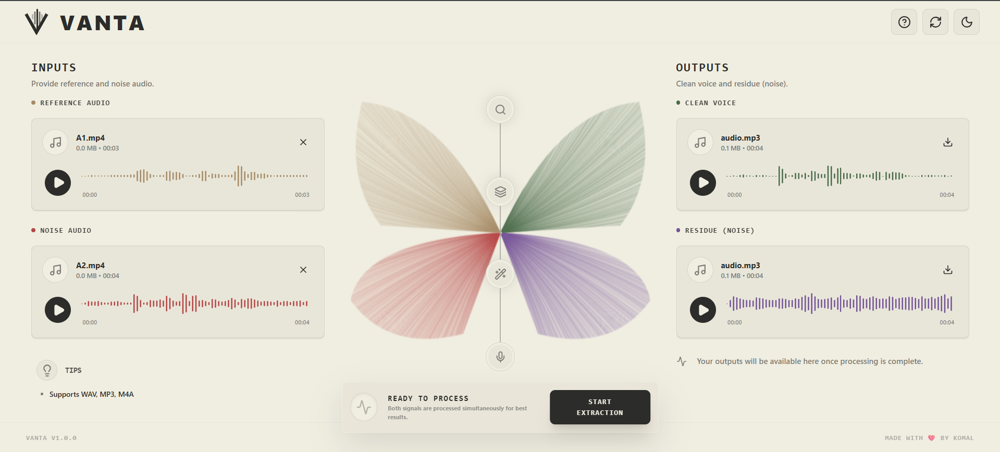

<div align="center">

# Vanta



### Isolate one voice from a room full of them.

Give Vanta a short reference clip of someone's voice and a messy recording.<br/>
It returns only that person — plus a residue track of everything it removed.

[](https://vanta.komalpreet.me)
[](https://komalsohal-vanta.hf.space/health)


**`+9.28 dB`** median SI-SDR on unseen speakers &nbsp;·&nbsp; **`9.5M`** parameters &nbsp;·&nbsp; **`0`** pretrained weights

</div>

---

> [!NOTE]
> **Everything learned here was trained here.** Both the separator *and* the
> speaker-recognition network were built and trained from scratch on a single
> 8 GB laptop GPU. No pretrained weights run in production — and the
> self-trained speaker encoder *outperformed* the pretrained model it replaced.

---

## Contents

| | |
|---|---|
| **[How it works](#-how-it-works)** · **[Architecture](#-architecture)** | What the system does and how it's built |
| **[Training](#-training)** · **[Reproducing](#-reproducing-the-training)** | Data, synthesis, and how to run it yourself |
| **[Results](#-results)** | Benchmarks, encoder head-to-head, what's actually deployed |
| **[Repository](#-repository-layout)** · **[Running locally](#-running-locally)** · **[Deployment](#-deployment)** | Getting hands on |
| **[Limitations](#-limitations)** | What it does *not* do |

---

## 🎯 How it works

Blind noise cancellation (Krisp, Zoom) removes *everything that isn't speech*.
Vanta is **informed** — it needs a fingerprint to know *who* to keep.

```
  🎤 reference clip  ─┐
   (~5s, target alone)│
                      ├──▶  Vanta  ──▶  🔊 extracted (target only)
  🔊 noisy mixture   ─┘                 🔉 residue   (everything removed)
   (up to 30s)
```

`extracted + residue` reconstructs the input **exactly** — the estimate is
aligned to the mixture before subtraction, so the decomposition holds.

> Nothing here is speaker-specific. Neither model has heard the people it's used
> on — identity arrives at inference time as the reference clip, so **any voice
> works**.

---

## 🏗 Architecture

```
                            mixture wav (B, T)
                                   │
                                   ▼
                      ┌────────────────────────┐
                      │ 1-D Conv Audio Encoder │  512 filters, kernel 16, stride 8
                      └────────────┬───────────┘
                                   │  (B, 512, T')
                                   ▼
reference ─▶ ECAPA-TDNN  ─▶ 192-d ──▶ TCN Separator
             ★ ours, 6.0M           24 dilated-conv blocks (3 × 8, dilation 2^k)
               trained here         speaker-conditioned (additive bias per block)
                                   │
                                   ▼
                          predicted mask (B, 512, T')
                                   │
                            enc × mask
                                   │
                      ┌────────────▼───────────┐
                      │  Transposed 1-D Conv   │  decoder, mirror of the encoder
                      └────────────┬───────────┘
                                   │
                                   ▼
                          extracted wav (B, T)
```

<table>
<tr><th align="left">Component</th><th align="right">Params</th><th align="left">Role</th></tr>
<tr><td>Separator (Conv-TasNet style)</td><td align="right"><code>3.5M</code></td><td>Predicts the mask that isolates the target</td></tr>
<tr><td>Speaker encoder (ECAPA-TDNN)</td><td align="right"><code>6.0M</code></td><td>Turns the reference clip into a 192-d fingerprint</td></tr>
<tr><td><b>Total</b></td><td align="right"><b><code>9.5M</code></b></td><td><b>All trained in this repository</b></td></tr>
</table>

<details>
<summary><b>Design decisions and why</b></summary>

<br/>

| Choice | Reason |
|---|---|
| **Time-domain conv encoder** | Learns its own basis — no STFT phase to reconstruct, unlike spectrogram masking (VoiceFilter) |
| **Per-block speaker conditioning** | The fingerprint is injected at *every* TCN block, so the model is reminded who to keep at every layer |
| **Global Layer Norm** | Pools statistics across the whole utterance — voice texture matters, absolute volume does not |
| **SI-SDR loss** | Scale-invariant, so a volume-mismatched estimate isn't penalised for being quiet |
| **AAM-Softmax** (encoder) | Verification needs *angles* to separate unseen speakers; plain cross-entropy only requires training classes be separable |
| **Attentive stats pooling** (encoder) | Learns which frames carry identity — uniform mean-pooling dilutes it with silence |

</details>

---

## 🎓 Training

Both models train on **synthetic mixtures**, because real recordings can't supply
the per-source ground truth SI-SDR needs.

> [!TIP]
> This was verified rather than assumed. On the AMI corpus, a close-talking
> headset explains only **~0.2–0.4 correlation** of the room mic even after time
> alignment — the two are related by a reverberant filter, so an SI-SDR target
> built that way is unreachable.

### Data sources

| Corpus | Contribution |
|---|---|
| [**LibriSpeech**](https://openslr.org/12) `clean-100/360` + `other-500` | 1,552 speakers of read English |
| [**AMI Meeting Corpus**](https://groups.inf.ed.ac.uk/ami/corpus/) headsets | 31 speakers of *conversational* speech — interruptions, laughter, fillers |
| [**WHAM!**](http://wham.whisper.ai/) | 15,000 real ambient recordings — cafés, streets, offices |
| [**MUSAN**](https://openslr.org/17) noise | 930 ambient clips |
| [**RIRS_NOISES**](https://openslr.org/28) | 60,218 room impulse responses — simulated **and** real measured rooms |

### Mixture synthesis

A **fresh mixture is generated per training step** — nothing is cached to disk,
so the model cannot memorise a fixed set.

```
y = mask_t · RIR(s_target) + mask_i · α · RIR(s_interference) + β · noise
```

| Stage | Detail |
|---|---|
| 🗣 Speakers | Target and interferer are always different people |
| 🏠 Reverberation | Independent RIR per source, 80% probability |
| 🔊 Interference SNR | **[0, +10] dB** — the target is never quieter than the interferer |
| 🌫 Noise SNR | [+5, +20] dB |
| ⏱ Turn-taking | 50% of mixtures mask each speaker to a random active span |
| 📻 Recording chain | Mic EQ tilt, band-limiting, soft clipping, µ-law codec, noise floor |

<details>
<summary><b>Two of these came from diagnosed failures — the reasoning matters</b></summary>

<br/>

**Interference SNR excludes the target being quieter.**
Training on `[−5, +5] dB` — where the interferer could be *louder* — produced a
model that scored **+1.2 dB** and hedged on everything, attenuating the whole
mixture rather than committing. Restricting to the realistic regime, where the
target is the prominent speaker, took it to **+7.1 dB**. The cost is honest and
documented: a voice buried under a louder one is out of distribution.

**Turn-taking exists because full-overlap training never teaches silence.**
With both speakers always active, the model never learns to output *nothing*
when the target stops — so on real conversation it passed the other person's
turns straight through. Masking each speaker to a random span fixes it, and the
label is masked identically so the target is genuinely silent where it should be.

**Recording-chain augmentation splits by design.**
Linear ops (EQ, band-limiting) apply to mixture **and** target alike — the model
shouldn't be asked to invent bandwidth the mic never captured. Mixture-only ops
(clipping, codec, noise floor) become artifacts to clean off.

</details>

### Training runs

Both trained on a single **RTX 4060 Laptop (8 GB)**.

| | 🎛 Separator | 🗣 Speaker encoder |
|---|---|---|
| **Params** | 3.5M | 6.0M |
| **Speakers** | 952 | 1,583 |
| **Epochs** | 40 (warm-started) | 20 |
| **Batch** | 4 × 3s clips | 64 × 2.5s clips |
| **Optimiser** | AdamW, cosine 5e-4 → 1e-5 | AdamW, cosine 1e-3 → 1e-5 |
| **Loss** | SI-SDR | AAM-Softmax (m=0.2, s=30) |
| **Precision** | bf16 mixed | bf16 mixed |
| **Wall clock** | ~4 h | ~7 h |

> The 8 GB ceiling shapes real choices: 3-second clips (4-second clips at 24
> blocks push allocation past 91% and throughput collapses), gradient
> accumulation for a larger effective batch, and bf16 throughout.

---

## 📊 Results

Evaluated on **500 held-out mixtures from speakers never seen in training**, on
the realistic benchmark — real noise, real and simulated rooms, turn-taking,
recording-chain degradation.

<div align="center">

| Metric | Value |
|:---|:---:|
| **SI-SDR** (mean) | **`+8.45 dB`** |
| **SI-SDR** (median) | **`+9.28 dB`** |
| Improvement over input mixture | `+5.50 dB` |
| PESQ | `1.247` |
| STOI | `0.751` |
| Target energy captured | `84.3%` |

</div>

### 🥊 Self-trained encoder vs. pretrained ECAPA

Replacing SpeechBrain's pretrained ECAPA with the encoder trained here
**improved every separation metric** and made CPU inference ~6× faster:

<div align="center">

| | pretrained ECAPA | **ours** |
|:---|:---:|:---:|
| SI-SDR | +7.93 dB | **+8.45 dB** |
| PESQ | 1.182 | **1.247** |
| STOI | 0.739 | **0.751** |

</div>

Head-to-head on the embeddings themselves, 40 held-out speakers
([`compare_encoders.py`](scripts/compare_encoders.py)):

<div align="center">

| | pretrained ECAPA | **ours** |
|:---|:---:|:---:|
| clean margin | +0.526 | **+0.607** |
| clean pair-accuracy | 99.2% | **99.8%** |
| degraded margin | +0.449 | **+0.538** |
| degraded pair-accuracy | **99.2%** | 98.0% |

</div>

> [!IMPORTANT]
> **Two honest caveats.** The pretrained encoder stays slightly more reliable on
> hard degraded pairs — what VoxCeleb's ~4× larger speaker count buys. And this
> evaluation is LibriSpeech throughout, the domain our encoder trained on, so it
> does not settle behaviour on arbitrary real-world recordings.

Swapping encoders is also **not free**: the separator learns to read one
embedding space, and switching without retraining cost **2.8 dB**
(+8.00 → +5.23). The two checkpoints are trained together and deploy as a pair.

### 🔍 Which model is actually serving

Production runs the from-scratch models above. A pretrained SepFormer backend
exists in the codebase but is **not active**, and there is deliberately **no
automatic fallback** — silently serving pretrained output while presenting it as
the trained model would misrepresent what users receive.

Switching is a manual operator decision, and
[`/health`](https://komalsohal-vanta.hf.space/health) always reports which
backend is live, so the claim is **verifiable rather than asserted**.

---

## 📁 Repository layout

```
vanta/
├── config.py                # Paths, sample rate (16 kHz)
├── losses.py                # SI-SDR loss
├── metrics.py               # SI-SDR + PESQ + STOI
├── training.py              # Train loop — AMP, grad accumulation, cosine LR, resume
├── inference.py             # Checkpoint loading, audio decode, extract + residue
│
├── data/
│   ├── indexer.py           # Speaker / noise / RIR indices, cached to JSON
│   ├── synthesize.py        # Mixture synthesiser — reverb, SNR, turn-taking
│   ├── augment.py           # Recording-chain degradation
│   ├── dynamic_dataset.py   # ★ Fresh mixture per __getitem__ (training)
│   ├── dataset.py           # Fixed manifest reader (validation)
│   ├── speaker_dataset.py   # ★ Speaker-classification data for the encoder
│   └── ami.py               # AMI real-recording loader
│
├── models/
│   ├── audio_encoder.py     # 1-D conv encoder + transposed-conv decoder
│   ├── ecapa_tdnn.py        # ★ Our ECAPA-TDNN + AAM-Softmax head
│   ├── speaker_encoder.py   # Encoder wrappers — ours / pretrained
│   ├── separator.py         # TCN blocks, gLN, speaker-conditioned mask
│   ├── sepformer_tse.py     # Pretrained fallback backend (not active)
│   └── vanta.py             # Top-level model
│
└── utils/audio.py           # Load/save, resample, SNR scaling, peak norm

scripts/
├── download_data.py         # Resumable download of speech / noise / RIR corpora
├── download_ami.py          # AMI meeting audio
├── segment_ami.py           # AMI headsets → single-speaker clips
├── build_dataset.py         # Generate a fixed manifest (validation sets)
├── train.py                 # Separator training CLI
├── train_speaker_encoder.py # ★ Speaker encoder training CLI
├── evaluate.py              # SI-SDR / PESQ / STOI on a manifest
├── compare_encoders.py      # ★ Head-to-head vs. pretrained ECAPA
├── bench_speaker_encoder.py # Embedding discriminability under degradation
├── bench_step.py            # Per-batch throughput + VRAM
└── test_*.py                # Smoke tests

server.py                    # FastAPI — /health and /extract
web/                         # Next.js + Tailwind frontend
deploy/hf-space/             # Docker bundle pushed to Hugging Face Spaces
```

---

## 💻 Running locally

**Prerequisites** — Python 3.11+, Node 20+, git-lfs, CUDA GPU (training only)

```bash
python -m venv .venv
.venv/Scripts/pip install torch torchaudio --index-url https://download.pytorch.org/whl/cu124
.venv/Scripts/pip install -r requirements.txt

# Inference server — defaults to the from-scratch separator + encoder pair
.venv/Scripts/python -m uvicorn server:app --port 8000

# Frontend
cd web && npm install && npm run dev   # http://localhost:3000
```

Then open **http://127.0.0.1:8000/docs** for an interactive API console.
`GET /health` reports which checkpoints are loaded.

| Variable | Default | Meaning |
|---|---|---|
| `VANTA_BACKEND` | `trained` | `trained` or `sepformer` |
| `VANTA_CHECKPOINT` | `checkpoints/fully_ours/best.pt` | Separator weights |
| `VANTA_SPK_ENCODER` | `checkpoints/spk_encoder/best.pt` | Speaker encoder — unset uses pretrained ECAPA |

---

## 🔬 Reproducing the training

<details>
<summary><b>Full pipeline, from empty repo to trained models</b></summary>

<br/>

```bash
# 1 ── Corpora (~50 GB, all resumable)
.venv/Scripts/python scripts/download_data.py
.venv/Scripts/python scripts/download_ami.py --meetings 20
.venv/Scripts/python scripts/segment_ami.py --seconds 8

# 2 ── Fixed validation set (training mixtures are generated on the fly)
.venv/Scripts/python scripts/build_dataset.py --n 500 --out datasets/vanta --split dev \
  --source dev-clean --intf-snr 0 10 --augment --partial-overlap 0.5

# 3 ── Speaker encoder
.venv/Scripts/python scripts/train_speaker_encoder.py \
  --splits train-clean-100 train-clean-360 train-other-500 \
  --out checkpoints/spk_encoder --epochs 20 --batch-size 64 --seconds 2.5

# 4 ── Separator, conditioned on that encoder
.venv/Scripts/python scripts/train.py --dynamic \
  --val-manifest datasets/vanta/dev/manifest.jsonl \
  --out checkpoints/separator --train-source train-clean-360 \
  --speaker-encoder checkpoints/spk_encoder/best.pt \
  --intf-snr 0 10 --augment --partial-overlap 0.5 \
  --epochs 40 --batch-size 4 --repeats 3 --clip-seconds 3.0 --lr 5e-4

# 5 ── Evaluate
.venv/Scripts/python scripts/evaluate.py --checkpoint checkpoints/separator/best.pt \
  --manifest datasets/vanta/dev/manifest.jsonl --repeats 3
.venv/Scripts/python scripts/compare_encoders.py
```

Both training scripts checkpoint every epoch and accept `--resume`.

</details>

---

## 🚀 Deployment

**Backend** — Docker image pushed to a Hugging Face Space.
[`deploy/hf-space/build.sh`](deploy/hf-space/build.sh) copies the minimal
inference subset plus both checkpoints into the bundle; `git push` uploads them
via Git LFS. CPU inference runs at **~0.2× realtime**.

**Frontend** — Vercel, from `web/`. Set `NEXT_PUBLIC_VANTA_API` to the Space URL
at build time.

---

## ⚠️ Limitations

| | |
|---|---|
| 🔉 **Target must be prominent** | Trained on [0, +10] dB interference SNR — a voice buried under a louder one is out of distribution |
| 📉 **84% of target energy captured** | The remainder stays in the residue, audible at roughly −33 dB |
| 📚 **Read-speech bias** | 1,552 of 1,583 speakers are LibriSpeech audiobooks; conversational coverage comes from only 31 AMI speakers |
| 🌍 **English-only** | Degrades on other languages |
| 📁 **File-based** | No real-time or streaming inference |
| 🏠 **Reverb preserved** | The model keeps room acoustics by design; dereverberation is a separate task |
| 📏 **Objective metrics only** | No MOS-rated listening study |

---

<div align="center">

**[Try it →](https://vanta.komalpreet.me)**

</div>
